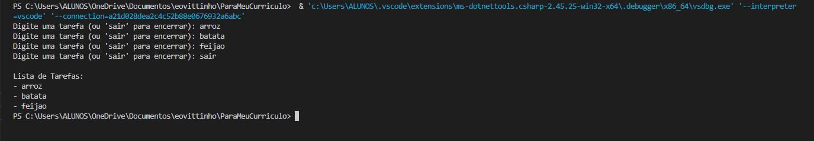

# ParaMeuCurriculo

## O que foi utilizado
O programa de lista de tarefas em C# consiste em uma classe chamada ListaDeTarefas, com um método principal que inicia a execução. Ele cria uma lista para armazenar tarefas e utiliza um loop que permite ao usuário adicionar tarefas continuamente. O usuário pode digitar uma tarefa ou "sair" para encerrar o loop. As tarefas digitadas são adicionadas à lista e, ao final, o programa exibe todas as tarefas armazenadas. Um loop é usado para imprimir cada tarefa. Essa estrutura simples permite gerenciar tarefas de forma eficaz. Se precisar de mais detalhes ou modificações, estou aqui para ajudar!

## Etapas Implementadas
As etapas implementadas no programa de lista de tarefas em C# incluem a importação dos namespaces necessários, a definição da classe `ListaDeTarefas` e a implementação do método principal como ponto de entrada. O programa cria uma lista para armazenar tarefas e utiliza um loop que permite ao usuário adicionar tarefas continuamente. O usuário é solicitado a digitar uma tarefa ou "sair" para encerrar o loop. As tarefas digitadas são armazenadas na lista e, ao final, o programa exibe todas as tarefas utilizando um loop para imprimir cada uma delas. Essas etapas formam a base para o gerenciamento simples de tarefas. Se precisar de mais detalhes, estou aqui para ajudar!

## Backlog
Adicionar funcionalidade para salvar tarefas em um arquivo, assim melhorando.

## Conclusão 
A conclusão do projeto de lista de tarefas em C# destaca a criação de uma aplicação simples e funcional que permite aos usuários gerenciar suas tarefas de forma eficaz. O programa implementa funcionalidades básicas, como a adição e exibição de tarefas, além de permitir melhorias futuras, como a remoção e edição de itens. A estrutura modular e as etapas de desenvolvimento estabelecidas garantem que o código seja fácil de entender e expandir. Com a possibilidade de adicionar persistência de dados e uma interface mais robusta, o projeto pode evoluir para atender melhor às necessidades dos usuários. Este projeto serve como uma excelente base para o aprendizado de C# e desenvolvimento de aplicações de console. Se precisar de mais informações ou sugestões, estou à disposição!